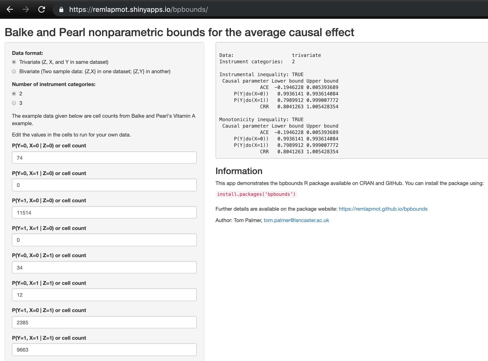

---
# PLEASE SEE THE README for in depth description github.com/brentthorne/posterdown
poster_height: "46.8in"
poster_width: "33.1in"
font_family: 'Rasa'
#ESSENTIALS
# title: 'bpbounds: R package and Shiny app for the nonparametric bounds for the average causal effect due to Balke and Pearl'
title: '**bpbounds**: R package and web app'
author:
  - name: '**Tom Palmer**'
    affil: 1
    main: true
    orcid: '0000-0003-4655-4511'
    # twitter: brentthorne18 
    email: tom.palmer@lancaster.ac.uk
  - name: Roland Ramsahai
    #orcid: '0000-0002-7349-1977'
    #affil: 2
    main: false
    # email: 'ag.con@posterdown.net'
  - name: Vanessa Didelez
    affil: 2
    #orcid: '0000-0001-8587-7706'
  - name: Nuala Sheehan
    affil: 3
    #orcid: '0000-0001-9094-2605'
affiliation:
  - num: 1
    address: Department of Mathematics and Statistics, Lancaster University
  - num: 2
    address: Leibniz BIPS, Bremen, Germany
  - num: 3
    address: Department of Health Sciences, University of Leicester
#STYLE & FORMATTING
title_textsize: "125pt"
author_textsize: "1.17em"
authorextra_textsize: "35px"
affiliation_textsize: "25px"
affiliation_textcol: '#00000080'
caption_fontsize: "20pt"
#Middle of the poster
middle_fontfamily: "Special Elite"
middle_textcol: "#FFFFFF" # white
middle:textalpha: 90
middle_fontsize: "150px"
main_findings:
  - "What **range** could your **causal effect** lie between if the instrumental variable assumptions held?"
  - "**Find out** with our **bpbounds R package** and **Shiny app**!"
logoleft_name: "Figures/Shield-Twitter.jpg"
#logocenter_name: "Figures/qrcode-bpbounds-pkgdown.png"
logoright_name: "Figures/Shield-Twitter.jpg"
#---POSTER BODY OPTIONS---#
primary_colour: '#b5121b' # LU red # '#0b4545'
secondary_colour: '#b5121b' # LU red # '#bec0c2' # '#008080'
accent_colour: '#b5121b' # LU red # "#cc0000"
body_bgcol: "#ffffff" # white
body_textsize: "45px"
body_textcol: "#000000" # black
reference_textsize: "20px"
#--Standard Options--#
output: 
  posterdown::posterdown_betterport:
    self_contained: false
    pandoc_args: --mathjax
    highlight: espresso
    number_sections: false
    template: template-new-tp.html
    #keep_md: true
bibliography: MyBib.bib
---
```{r setup, include=FALSE}
knitr::opts_chunk$set(
  results = 'asis',
  echo = FALSE,
  warning = FALSE,
  message = FALSE,
  fig.align = 'center'
)
```

# Introduction

* We present our bpbounds R package and Shiny web app for the nonparametric bounds for the average causal effect (ACE) due to Balke and Pearl [@bpbounds-package]. 
* This is an R implementation of our Stata programs [@palmer-sj-2011].
* The package can be installed from CRAN as follows:
```{r, echo=TRUE, eval=FALSE}
install.packages("bpbounds")
```

* Code development is on the GitHub repository:
https://github.com/remlapmot/bpbounds

# Methods

* Under the instrumental variable assumptions alone, without additional parametric model assumptions, the ACE is not identified. 
* @balke-jasa-1997 showed it is possible to derive bounds for the ACE.
* The bounds have the following interpretation: 

> There is some joint distribution of the unobserved confounders and the observed variables that yields a true ACE as small as the lower bound, while another choice produces an ACE as large as the upper bounds (the bounds are tight).

* There are at least two ways to implement the Balke-Pearl bounds:

i) using conditional probabilities calculated from contingency tables;
ii) the polytope method due to @dawid-hsss-2003.

* We implemented the polytope method since it is generalisable for identified IV models with exposures, outcomes, and instruments with more than 2 categories.
* Currently, we allow for a binary or 3 category instrument, and binary exposure and outcome.

# Example Mendelian randomization analysis

* We extract an example from @meleady-ajcn-2003. 
* We have a 3 category instrument and binary exposure and outcome. 
* We use the 677CT polymorphism (rs1801133) in the MTHFR gene, involved in folate metabolism, as an instrumental variable to investigate the causal effect of homocysteine on the risk of cardiovascular disease.
* The code is shown on the right.
* The ACE lies between a risk difference of -9% to 74% increase in absolute risk.
* Additionally, we see that the monotonicity inequality is not satisfied.

# Conclusion

* Use of bounds in instrumental variable analyses is regaining interest [@swanson-jasa-2018; @labrecque-cer-2018].
* The empirical experience that the bounds are often wide is not a bad property of the method, it is a property of the typical data: Mendelian randomization data simply often are uninformative in that sense due to weak instrumental variables.
* We recommend using the bounds when the variables are genuinely discrete, but not when the exposure is genuinely continuous [@sheehan-hg-2019].
* Our R package and app provide a convenient interface to the bounds.

# References

<div id="refs" class="references"></div>

#### 

# Extra Figures & Tables

```{r echo=TRUE, results='markup', collapse=TRUE}
library(bpbounds)
mt3 <- c(.83, .05, .11, .01, 
         .88, .06, .05, .01, 
         .72, .05, .20, .03)
p3 <- array(mt3, dim = c(2, 2, 3),
           dimnames = list(x = c(0, 1),
                           y = c(0, 1),
                           z = c(0, 1, 2)))
bpres3 <- bpbounds(as.table(p3))
summary(bpres3)
```

```{r qrcode-shiny, out.width="38%", fig.cap='Shiny app https://remlapmot.shinyapps.io/bpbounds'}

```

```{r shiny-app-screenshot, out.width="80%", fig.cap='Screenshot of our Shiny app.'}

```

```{r qrcode-pkgdown, out.width="38%", fig.cap='Package website https://remlapmot.github.io/bpbounds/'}

```
